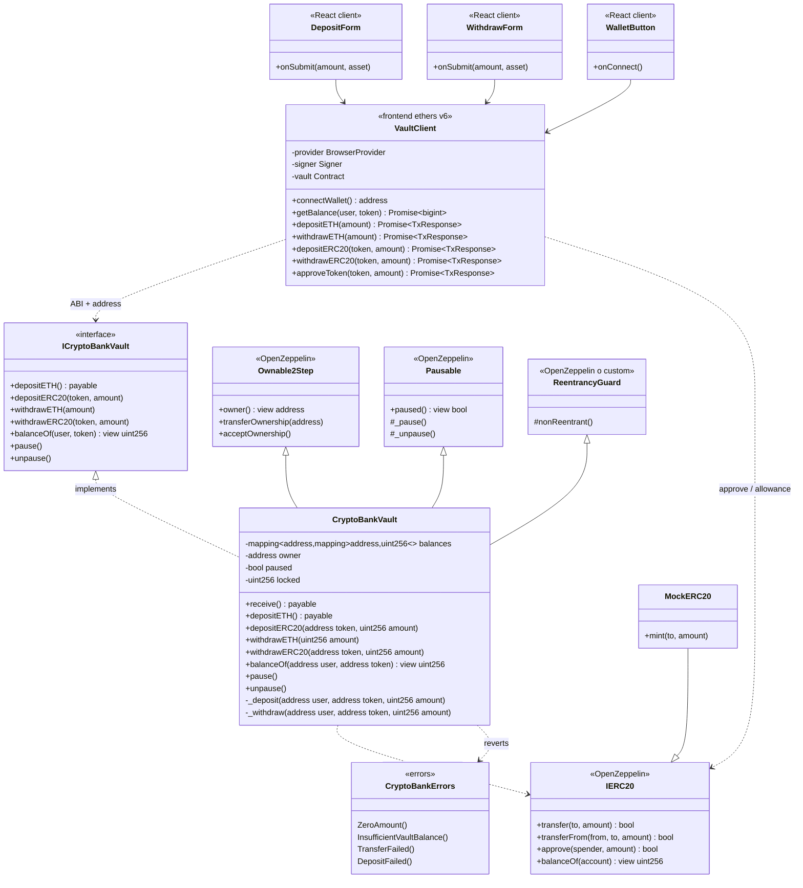

# Diagrama de clases — Crypto Bank Vault

Vista estática de tipos, responsabilidades y relaciones entre contratos on-chain y la capa frontend (ethers.js).

---

## 1. Diagrama de clases (on-chain + frontend)



---

## 2. Notas de diseño

### 2.1 Ledger

- Clave compuesta: `balances[user][token]`.
- ETH nativo: token sentinel `address(0)` (constante documentada, p. ej. `NATIVE = address(0)`).

### 2.2 Herencia OZ

- Preferir **Ownable2Step** + **Pausable** + **ReentrancyGuard** de OpenZeppelin v5.
- Alternativa permitida por reglas del módulo: guard custom `uint256` / transient, siempre con CEI.

### 2.3 Frontend

- `VaultClient` encapsula ethers (`BrowserProvider`, `Contract`).
- Componentes React no hablan RPC directamente: delegan en `VaultClient` / hooks finos.
- Validación de montos y addresses con **Zod** antes de firmar txs.

### 2.4 Eventos sugeridos (no dibujados arriba)

```solidity
event Deposited(address indexed user, address indexed token, uint256 amount);
event Withdrawn(address indexed user, address indexed token, uint256 amount);
event EmergencyPaused(address indexed account);
event EmergencyUnpaused(address indexed account);
```

---

## 3. Convención de layout Solidity (referencia)

Orden de elementos en `CryptoBankVault.sol`:

1. Interfaces / imports  
2. Errores / eventos  
3. Constantes e immutables  
4. Variables de estado  
5. Modifiers  
6. Constructor  
7. `receive` / `fallback`  
8. Externals → publics → internals → privates  
