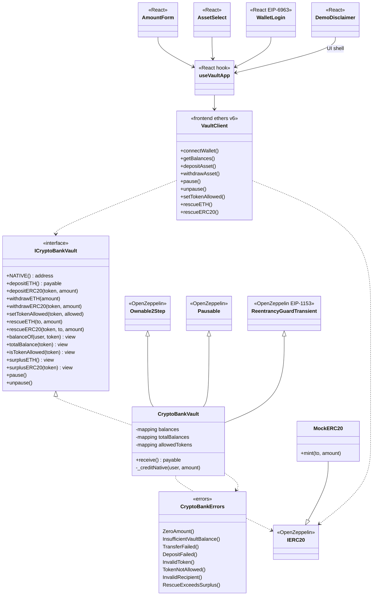

# Diagrama de clases — Crypto Bank Vault

Vista estática de tipos, responsabilidades y relaciones entre contratos on-chain y la capa frontend (ethers.js). Alineado a la implementación final (Fase 6).

---

## 1. Diagrama de clases (on-chain + frontend)

---

## 2. Notas de diseño

### 2.1 Ledger

- `balances[user][token]`; ETH = `NATIVE` (`address(0)`).
- `_totalBalances[token]` para surplus / rescue.

### 2.2 ERC-20

- Depósitos solo si `isTokenAllowed(token)`.
- `depositERC20` acredita **delta** de `balanceOf` (fee-on-transfer en depósito).
- Retiros no exigen allowlist (saldos ya acreditados).

### 2.3 Herencia OZ

- Ownable2Step + Pausable + ReentrancyGuardTransient (Cancun).

### 2.4 Frontend

- `VaultClient` + `useVaultApp`; assets desde `NEXT_PUBLIC_ASSETS` (`SYM:native[:d]` / `SYM:0x…[:d]`).
- Disclaimer de prueba + `/ayuda.html`.
- Login firmado = UX demo (no SIWE server).

### 2.5 Eventos

`Deposited`, `Withdrawn`, `TokenAllowlistUpdated`, `Rescued`, más `Paused`/`Unpaused` de OZ.

---

## 3. Convención de layout Solidity

1. Imports  
2. Errores / eventos (en interfaz + impl según diseño actual)  
3. Constantes  
4. Estado  
5. Constructor  
6. `receive`  
7. Externals → views → internals  
