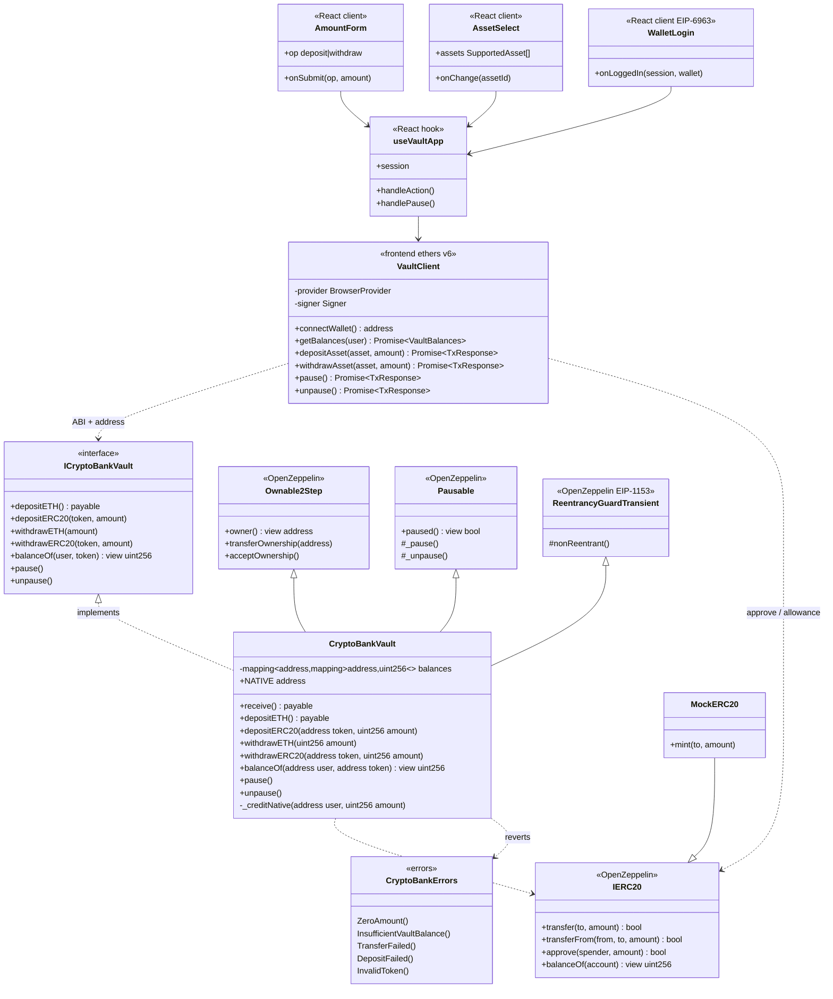

# Diagrama de clases — Crypto Bank Vault

Vista estática de tipos, responsabilidades y relaciones entre contratos on-chain y la capa frontend (ethers.js).

---

## 1. Diagrama de clases (on-chain + frontend)



---

## 2. Notas de diseño

### 2.1 Ledger

- Clave compuesta: `balances[user][token]`.
- ETH nativo: token sentinel `address(0)` (`NATIVE`).

### 2.2 Herencia OZ

- **Ownable2Step** + **Pausable** + **ReentrancyGuardTransient** (OpenZeppelin v5 / Cancun).

### 2.3 Frontend

- `VaultClient` encapsula ethers (`BrowserProvider`, `Contract`).
- `useVaultApp` concentra sesión, saldos y txs; los componentes solo renderizan.
- Assets desde `NEXT_PUBLIC_ASSETS` (`SYM:native[:d]` / `SYM:0x…[:d]`).
- Validación de montos con **Zod** antes de firmar txs.
- Login por firma: **demo UX**, no auth de servidor.

### 2.4 Errores

- `DepositFailed`: **reservado** (tokens no estándar / shortfall). Hoy SafeERC20 revierte por su cuenta; el contrato no emite este error.

### 2.5 Eventos

```solidity
event Deposited(address indexed user, address indexed token, uint256 amount);
event Withdrawn(address indexed user, address indexed token, uint256 amount);
```

(Pause usa eventos OZ `Paused` / `Unpaused`.)

---

## 3. Convención de layout Solidity (referencia)

Orden de elementos en `CryptoBankVault.sol`:

1. Interfaces / imports  
2. Errores / eventos  
3. Constantes e immutables  
4. Variables de estado  
5. Modifiers  
6. Constructor  
7. `receive` / `fallback`  
8. Externals → publics → internals → privates  
