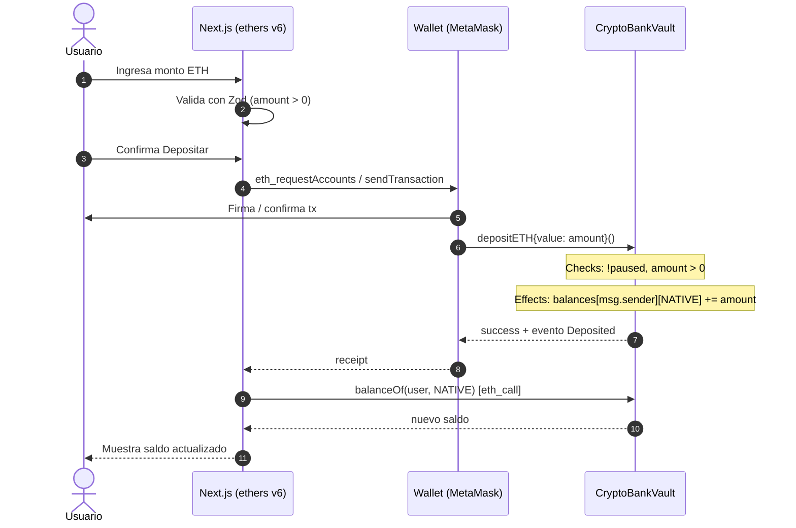
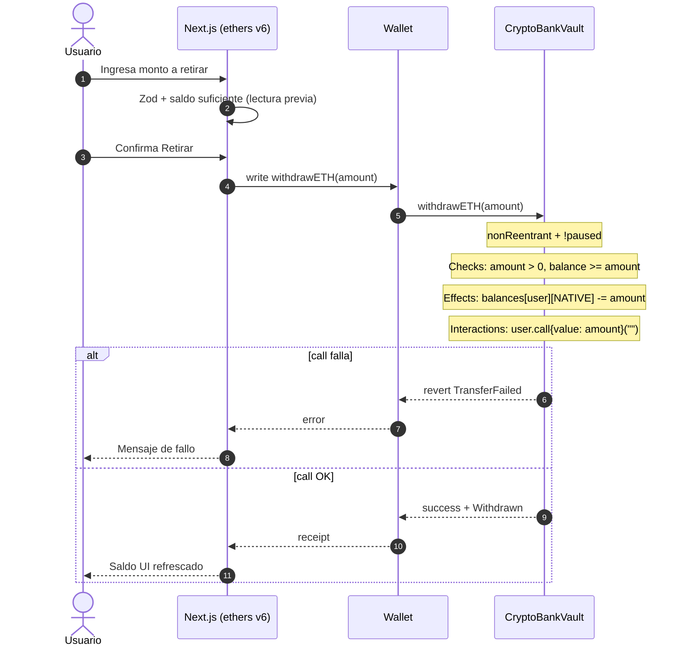
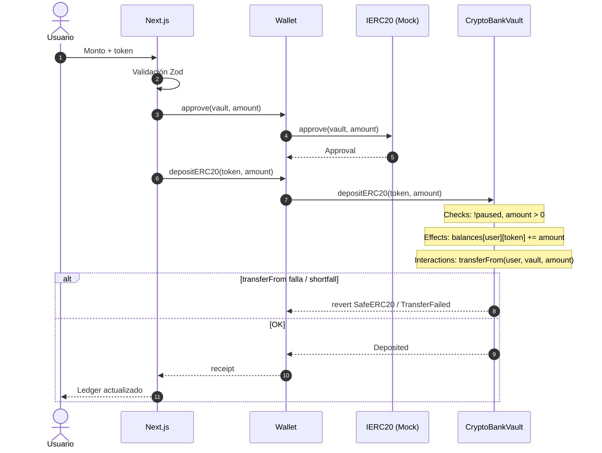
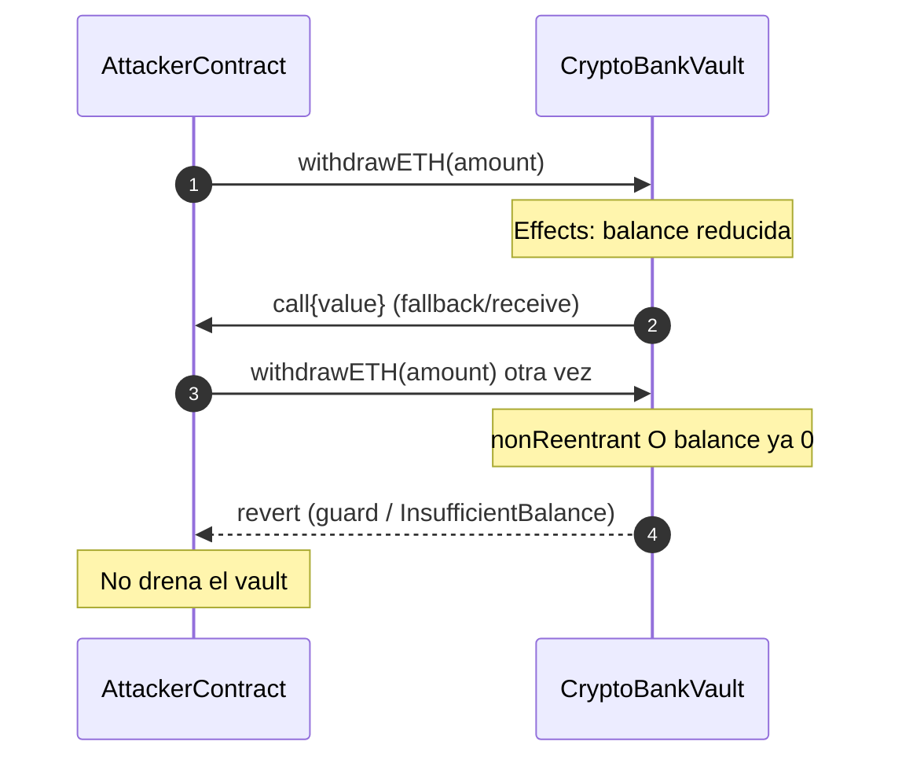
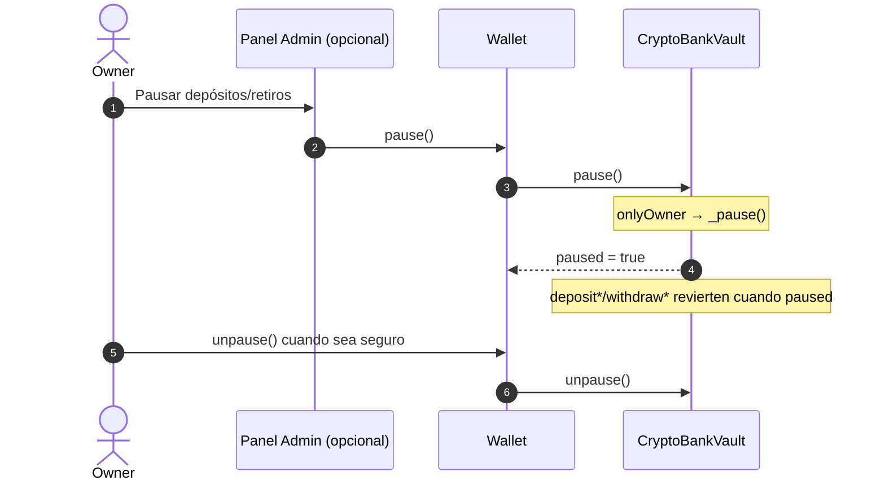
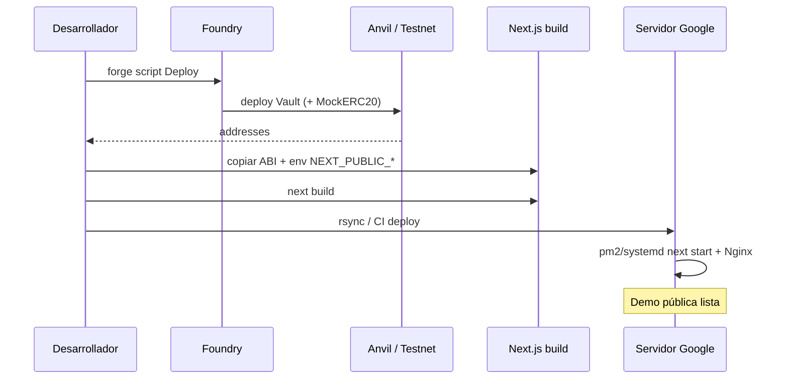

# Diagrama de flujo — Crypto Bank Vault

Secuencias de interacción entre **usuario**, **frontend (ethers.js)** y **contratos**. Complementa el [flujograma de decisiones](./03-flujograma.md).

---

## 1. Depósito de ETH

---

## 2. Retiro de ETH (CEI + call)

---

## 3. Depósito ERC-20 (approve + deposit)

> **Nota CEI:** el orden exacto effects↔`transferFrom` debe quedar fijado en implementación y tests. Para tokens honestos, un patrón seguro es: checks → effects (crédito) → `transferFrom` → si falla, revert (rollback de la tx). Alternativa conservadora: `transferFrom` midiendo delta de balance y luego effects; documentar la elección en NatSpec.

---

## 4. Ataque de reentrancy (debe fallar)

---

## 5. Pausa de emergencia (owner)

---

## 6. Flujo de despliegue demo (VPS Google)

