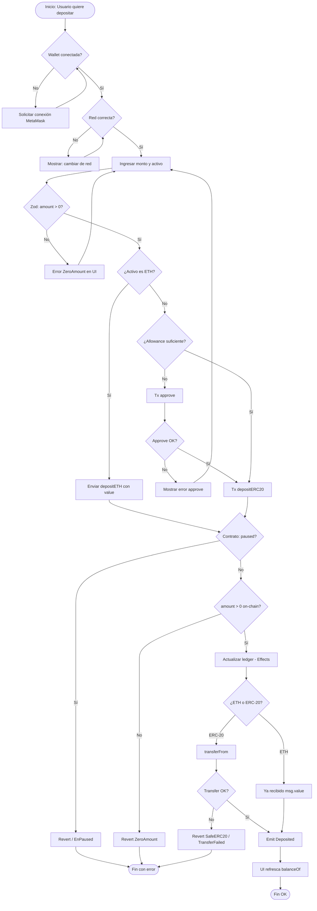
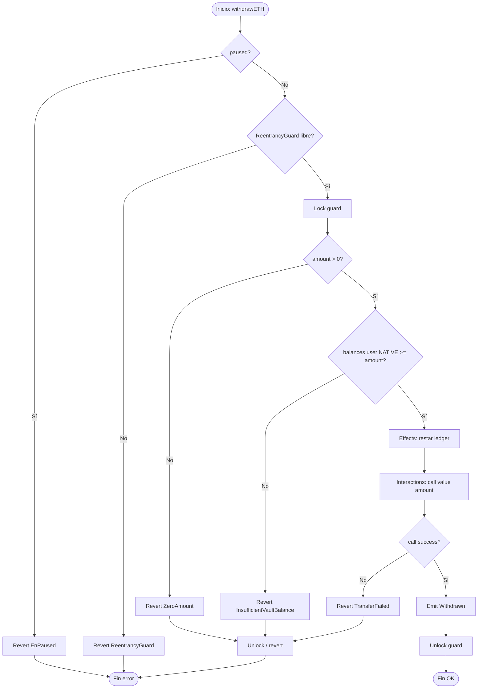
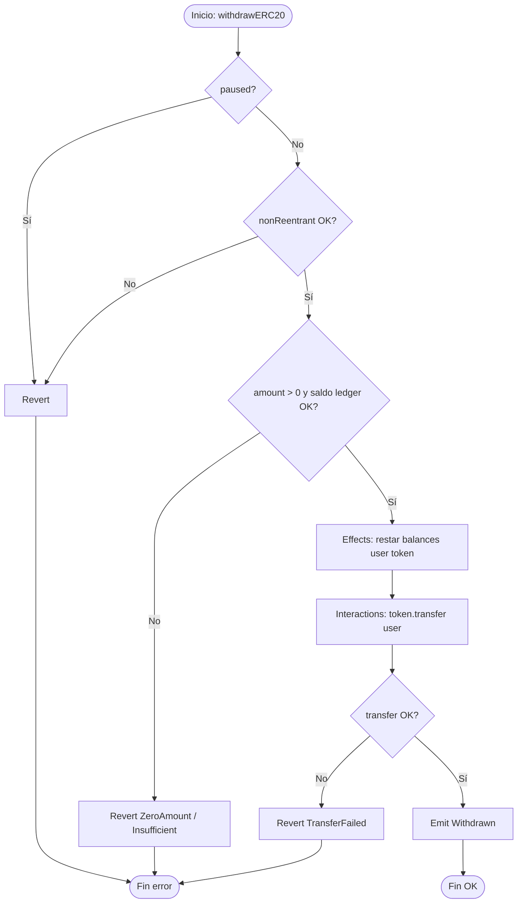
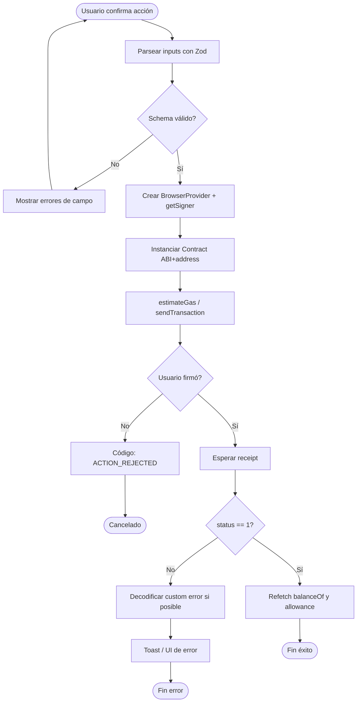
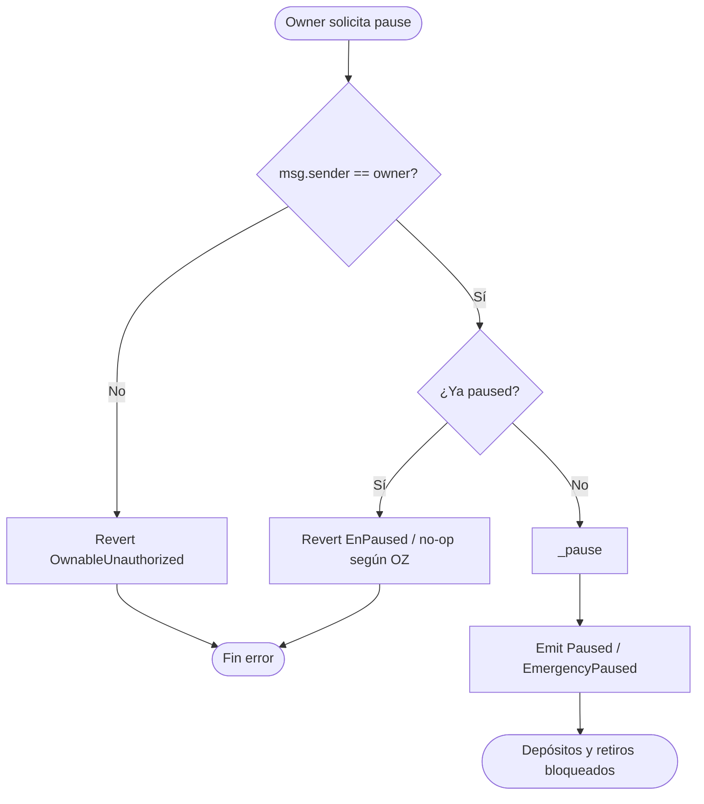

# Flujograma — Crypto Bank Vault

Diagramas de decisión (sí/no) para las operaciones críticas del vault y del frontend. Ver también el [diagrama de flujo / secuencias](./02-diagrama-flujo.md).

---

## 1. Flujograma general: depósito (ETH o ERC-20)

---

## 2. Flujograma: retiro ETH

---

## 3. Flujograma: retiro ERC-20

---

## 4. Flujograma: frontend — envío de transacción

---

## 5. Flujograma: operación owner — pausa

---

## 6. Leyenda rápida

| Símbolo | Significado |
|---------|-------------|
| Óvalo | Inicio / fin |
| Rectángulo | Proceso o efecto de estado |
| Rombo | Decisión |
| CEI | Checks → Effects → Interactions, en ese orden |
| Guard | `nonReentrant` evita reentrada durante `call` |
